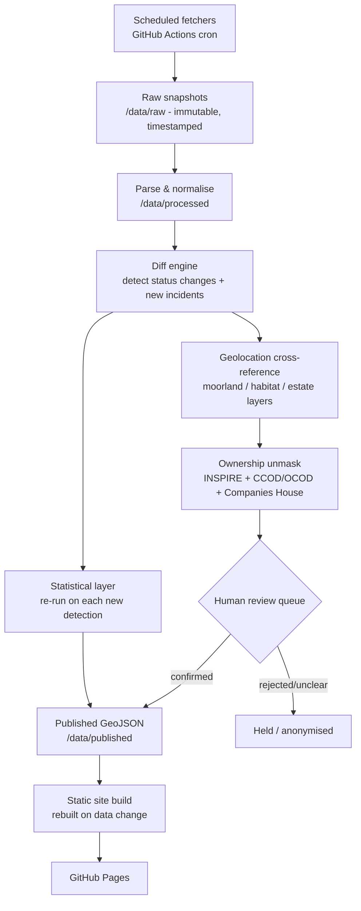

# UK Raptor Persecution Tracking Tool — Technical Architecture & Build Spec

Prepared: 10 July 2026. Handoff document for implementation (e.g. by Claude Code). All data sources below were checked live in July 2026; re-verify anything marked ⚠ before building, since several of these are informally-maintained government pages that change without notice.

## 1. Purpose

Automate detection of UK satellite-tagged bird-of-prey status changes (starting with hen harriers), cross-reference last known locations against grouse moor / land ownership data, and publish a continuously-updated, transparently-sourced public map — with a mandatory human review gate before anything is attributed to a named estate or owner. Runs entirely on GitHub (Pages + Actions), zero paid services.

## 2. Architecture overview

Five layers, each running on its own schedule, writing to flat files in the repo, gated by a human review step before public attribution:



The core design principle: **automation gets you to "flagged, located, candidate-matched." A human gets you to "published with a named estate."** Nothing crosses that line unattended.

Two detection speeds run in parallel, because the sources move at different speeds:
- **Slow/authoritative**: Natural England's official tag-status table (irregular, weeks-to-months).
- **Fast/unofficial**: RSS monitoring of Raptor Persecution UK and RSPB, which frequently report a bird "gone missing" or a prosecution days to weeks before it would show up in an official table update — sometimes the only public record at all, particularly for Scotland (see §3).

## 3. Data sources

| Source | What it gives you | Access method (verified July 2026) | Update cadence | Licence | Reliability notes |
|---|---|---|---|---|---|
| **NE Hen Harrier Tracking Update** (gov.uk) | Per-bird status table: tag status, approximate last location, notes | HTML page linking a downloadable **.ods spreadsheet** per update round — [gov.uk/government/publications/hen-harriers-tracking-programme-update](https://www.gov.uk/government/publications/hen-harriers-tracking-programme-update/hen-harrier-tracking-update). No API. Scrape the page for the newest dated section + `.ods` link, download, parse. | Irregular: gaps have ranged 2–6 months (e.g. Feb→Apr→Jun 2026 = 2 months each; Oct 2025→Feb 2026 = 4 months; Apr→Oct 2025 = 6 months). Historically described as "every 3 months" but don't rely on that. | OGL v3.0, Crown copyright | ⚠ **Medium-high fragility.** ODS schema has drifted over the programme's history (column names/format differ 2017 vs 2026 files) — parser must be tolerant, not assume a fixed schema. Also: 17 birds have **deliberately coarsened locations** for species-protection reasons (NE will not publish precise roost/nest sites) — don't treat a missing precise fix as a scraper bug. |
| **NE blog** (naturalengland.blog.gov.uk) | Ad hoc narrative posts, often faster than the quarterly table (e.g. "Update on the deaths of three tagged hen harriers") | Confirmed working **Atom feed**: `naturalengland.blog.gov.uk/feed` | Ad hoc, event-driven | OGL v3.0 | Low-medium fragility — standard blog feed. Good secondary corroboration signal, not a replacement for the table. |
| **Moorland Change Map** (Natural England Open Data Geoportal / ArcGIS Hub) | Vector layer of change (chiefly burning) in heather-dominant uplands, Sentinel-2 derived | ArcGIS Hub dataset, e.g. [naturalengland-defra.opendata.arcgis.com/datasets/Defra::moorland-change-map-england-2024-2025](https://naturalengland-defra.opendata.arcgis.com/datasets/Defra::moorland-change-map-england-2024-2025/about). Standard Esri Hub mechanism: FeatureServer REST endpoint + GeoJSON/Shapefile/CSV download, exposed via the dataset's "APIs" tab. ⚠ A direct `.geojson` URL append did **not** resolve cleanly in testing — grab the exact FeatureServer URL from the live "APIs" tab at build time (a 5-minute task, not a research gap). | **Annual** — one dataset per burning season (Oct–Apr), published as a new, separately-named item each year (`...-2023-2024`, `...-2024-2025`, etc.) | OGL (standard for NE Geoportal; confirm per-dataset) | ⚠ Medium fragility: the **dataset name changes every year**, so don't hardcode a URL — query the Geoportal for the current "Moorland Change Map" item programmatically. Shows *change/burning activity*, not an authoritative "this is a grouse moor" boundary — it's a management-activity proxy, not a designation. |
| **Priority Habitats Inventory (England)** — upland heathland (UHEAT) | Baseline habitat extent layer, complements Moorland Change Map | [naturalengland-defra.opendata.arcgis.com/datasets/Defra::priority-habitats-inventory-england](https://naturalengland-defra.opendata.arcgis.com/datasets/Defra::priority-habitats-inventory-england/about) — no access constraints | Infrequent updates | OGL | Large dataset — exceeds Shapefile limits, use GeoJSON/File GeoDatabase. Low fragility (stable NE dataset). |
| **CRoW Act 2000 Access Layer** | "Open country" (mountain/moor/heath/down) mapped extent — another moorland-extent proxy | [naturalengland-defra.opendata.arcgis.com/datasets/Defra::crow-act-2000-access-layer](https://naturalengland-defra.opendata.arcgis.com/datasets/Defra::crow-act-2000-access-layer/about) | Infrequent | OGL | Low fragility. |
| **HM Land Registry INSPIRE Index Polygons** | Freehold title polygon extents + title number (England & Wales) | GML bulk download via [use-land-property-data.service.gov.uk/datasets/inspire](https://use-land-property-data.service.gov.uk/datasets/inspire) | Monthly, first Sunday | OGL, but ⚠ **see legal note below** | Stable file-drop mechanism. Gives geometry + title number only — **no owner name** unless owner is a company (see CCOD/OCOD). Individual/trust-owned land needs a paid title register (~small per-title fee) to get a proprietor name — not automatable at scale, and that's by design. |
| **CCOD / OCOD** ("UK/Overseas companies that own property in England & Wales") | Company name + registered address for **company-owned** titles. Confirmed fields: title number, tenure, property address, district/county/region/postcode, proprietor name, company registration number, proprietorship category, proprietor address, date proprietor added, change indicator | CSV bulk (complete file + change-only file) + JSON API after free account + licence agreement, via [use-land-property-data.service.gov.uk/datasets/ccod](https://use-land-property-data.service.gov.uk/datasets/ccod) and `/ocod` | Monthly, 2nd working day (covers previous month) | Free (HMLR made this free; OGL) | Stable. This is the "unmask shell companies" layer feeding Companies House — but HMLR is explicit that CCOD/OCOD together **exclude private individuals, and CCOD also excludes charities** (charity-owned estates would need a separate Charity Commission lookup). Family trusts and individual ownership — common for aristocratic grouse moor estates — remain unautomatable by design; that's a feature of the legal-caution requirement, not a bug to work around. |
| **Companies House API** | Company officers, PSCs (persons with significant control), filing history | REST/JSON, free API key, [developer.company-information.service.gov.uk](https://developer.company-information.service.gov.uk/) | Real-time | Free, OGL-equivalent terms | **Low fragility** — stable, well-documented official API. Rate limit: 600 requests/5 min per key (429 + reset thereafter). |
| **OS Data Hub** (successor branding to "OS OpenData") | Base mapping, boundaries, place names — OS Open Names, Boundary-Line, Open Rivers, Terrain 50, etc. | Free API tier (Maps/Features/Names/Linked Identifiers APIs) at [osdatahub.os.uk](https://osdatahub.os.uk/), GeoJSON/vector tiles; also plain downloads (GeoPackage/Shapefile/GML/CSV) | Periodic dataset refreshes | OGL | Low fragility. Use for basemap tiles + place-name gazetteer (e.g. rendering "near Nidderdale" rather than raw coordinates), not for grouse-moor-specific data. GB coverage only (NI is separate via OSNI, out of scope here). |
| **Raptor Persecution UK blog** | Independent, fast-moving investigative reporting; frequently the first public mention of a bird "gone missing," and for Scotland often the **only** public record (no Scottish equivalent of NE's table exists) | Confirmed working RSS: `raptorpersecutionuk.org/feed` | Near-daily during incidents | Site content is copyrighted (independent blog, not Crown copyright) — link and quote under fair dealing, don't republish full posts | Low-medium fragility (standard RSS). High false-positive risk for automated bird-name/incident extraction — needs a human step before treating a blog mention as a "confirmed" detection. Actively publishing as of June 2026 (verified). |
| **RSPB press releases / "Birdcrime" annual report** | Official RSPB incident statistics and case announcements | HTML listing at rspb.org.uk media centre (no RSS found — treat as scrape fallback); annual Birdcrime PDF report | Ad hoc releases; annual report | RSPB copyright, quote/link under fair dealing | RPUK typically mirrors RSPB releases within days, so RPUK monitoring covers most of this already. Birdcrime PDF is a good annual context/background statistic, not a live feed. |
| **National Wildlife Crime Unit (NWCU)** | UK-wide raptor persecution priority reporting | [nwcu.police.uk/how-do-we-prioritise/priorities/raptor-persecution](https://www.nwcu.police.uk/how-do-we-prioritise/priorities/raptor-persecution/) | Periodic/annual | Crown copyright | Background/context source, not incident-level or real-time. |
| **Wildlife and Countryside Link — annual Wildlife Crime Report** | UK wildlife crime conviction-rate statistics | HTML/PDF report, published annually | Annual | Check per-report | Context source only. |
| **2019 Nature Communications study** (Murgatroyd et al., "Patterns of satellite tagged hen harrier disappearances suggest widespread illegal killing on British grouse moors") | Peer-reviewed methodology to (partially) replicate | [nature.com/articles/s41467-019-09044-w](https://www.nature.com/articles/s41467-019-09044-w) — open access | One-off (2019); not updated | CC-BY (Nature Communications default) | See §6 — **full replication is not possible from public data alone** (see limitation below). |

### Additional sources found during this research (not in the original brief)

- **Who Owns England / grousemoors.whoownsengland.org** — direct prior art. Guy Shrubsole and Anna Powell-Smith already built a one-off (2018) map of ~100 English grouse moor estates with approximate boundaries and ownership, and even overlaid 2007–2016 NE hen harrier last-known-locations on it. Their methodology combined Environmental Stewardship payment maps (OGL, but stale — last updated Nov 2016), INSPIRE polygons (republished under a **news-reporting/fair-dealing exemption, not a blanket redistribution licence** — important precedent, see legal note below), and the Moorland Association's own approximate grouse-moor-extent map, sense-checked against aerial imagery. **This is the closest thing to an authoritative open "grouse moor boundary" layer that exists** — there is no clean government dataset that says "this polygon is a grouse moor." Recommend: (a) contact Shrubsole/Powell-Smith directly — direct topical overlap, possible collaboration or data-sharing rather than rebuilding from scratch; (b) check [github.com/annapowellsmith](https://github.com/annapowellsmith) for reusable code; (c) treat their estate layer as a starting point that needs re-verification, not a source to blindly trust as current.
- **Scotland: Wildlife Management and Muirburn (Scotland) Act 2024**, amended by the **Natural Environment (Scotland) Act 2026** — introduced mandatory licensing (administered by NatureScot) for red grouse shooting and muirburn, with licences suspendable/revocable on evidence of raptor persecution. No public register of licence holders was found in this research — worth monitoring, since a future public licence register would be a very strong direct signal ("this estate's licence was suspended") if/when NatureScot publishes one. Flagged as an open watch-item, not a currently usable source.
- **RSPB Scotland / South of Scotland Golden Eagle Project** — active satellite tagging of golden eagles (and hen harriers, e.g. at Langholm/Tarras Valley) in Scotland, but **no structured public tag-status table** was found equivalent to NE's England table. This means Scotland detection currently has to rely on RPUK/RSPB press-release monitoring only — a real data asymmetry between England and Scotland worth designing around rather than assuming parity.
- **CAP Payments Search tool** (used by Who Owns England historically for subsidy context) — this was an EU-era mechanism; post-Brexit UK farm subsidy has moved to ELMS/Countryside Stewardship/SFI administered by Defra/RPA. ⚠ Not independently verified this session — if pursued, check for a current Defra/RPA subsidy-transparency equivalent rather than assuming the old CAP tool still applies.

## 4. Pipeline stages

**Stage A — Ingest.** Scheduled fetchers pull each source and write an **immutable, timestamped raw snapshot** (never overwritten) to `/data/raw/<source>/<date>.<ext>`. This is the provenance backbone: every published claim traces back to an exact raw file with an exact fetch timestamp, which matters both for the "transparent sourcing and timestamps" requirement and for your own defensibility as a journalist.

**Stage B — Parse & normalise.** Convert each raw snapshot into a consistent internal schema in `/data/processed/` (e.g. `birds.json`: one record per tagged bird with tag ID, species, status, last-known coordinates, coordinate precision/redaction flag, source timestamp).

**Stage C — Diff & detect.** Compare the latest normalised snapshot against the previous one. A bird transitioning from "transmitting"/"alive" to "signal lost"/"tag stopped"/"presumed dead" generates an **event** appended to `bird_events.json` (append-only log — never edit history, only add to it). In parallel, the RSS/blog monitor keyword-matches new posts against known tag names/species/locations and creates lower-confidence "candidate events" for human triage.

**Stage D — Geolocation cross-reference.** For each event with a resolvable last-known location, spatially join against the Moorland Change Map, Priority Habitats Inventory, CRoW Act layer, and the Who Owns England estate layer, producing a candidate match with an explicit confidence tier: *exact estate match* / *within mapped moorland habitat, no specific estate identified* / *location not disclosed by NE (redacted)*. This is metadata only at this stage — nothing here names an owner yet.

**Stage E — Ownership unmask.** Only runs where Stage D produced an estate/title match. Look up the title number against INSPIRE polygons, check CCOD/OCOD for a corporate proprietor, and if found, pull officers/PSCs from Companies House. Output sits in `ownership_matches.json` tagged `unreviewed` — this stage populates candidate facts, it does not publish them.

**Stage F — Human review queue.** Every event, geolocation match, and ownership unmask lands in a review queue (see §5) with a status field. Nothing reaches the public map with a named estate/owner until a human sets that status to `confirmed`.

**Stage G — Statistical layer.** Re-runs on each new confirmed event (or on a monthly schedule) over the accumulated dataset — see §6.

**Stage H — Publish.** On any change to the reviewed/confirmed data, a GitHub Actions workflow rebuilds the static site from `/data/published/*.geojson` and deploys to GitHub Pages. Every rendered item carries a "last confirmed: [date]" / "source last refreshed: [date]" label — never implying real-time tracking.

## 5. Review & publishing workflow

This is the legally load-bearing part of the design, so it should be a genuine gate, not a formality:

1. An automated detection (status change, blog mention, or geolocation match) is written to `review_queue.json` with `status: "pending"` and every supporting fact (raw source links, confidence tier, timestamps).
2. A GitHub Action opens a **GitHub Issue** (or updates a pinned "review queue" Issue) summarising the pending item, so it's visible and actionable outside the repo's raw JSON.
3. You (or another designated reviewer) review the evidence and change the status to one of: `confirmed-located` (publish with region/habitat context, no owner named), `confirmed-attributed` (publish with named estate/owner — this tier should require the strongest evidence and ideally a second pair of eyes or brief legal sanity-check, especially early on), `insufficient-evidence` (hold, don't publish), or `false-positive` (discard, log why for tuning the detector).
4. Only `confirmed-located` and `confirmed-attributed` items are written to `/data/published/`. Everything else stays in the private-to-the-repo review queue (or, if the repo is public, is visible as "under review" but without the specifics that would constitute an accusation — this is a judgement call, see §11).
5. Status changes are made via normal GitHub pull requests/commits — meaning the review history itself is a free, timestamped audit trail.

## 6. Statistical layer — realistic scope

Murgatroyd et al. (2019) used the **full GPS fix history** (20,000+ fixes across 58 birds) plus RSPB's own bespoke grouse-moor land-cover classification, comparing terminal-week fix distribution against lifetime range use via survival/home-range modelling. Two things make an exact replication **not achievable from public data alone**, and the build spec should be explicit about this rather than overclaiming:

- NE's public releases give **periodic status snapshots and an approximate last-known location**, not the underlying raw GPS fix trail for each bird. The fix-level data that powered the original study isn't part of the routine public release.
- There is no open equivalent of RSPB's bespoke grouse-moor land-cover layer (see §3) — only proxies (Moorland Change Map, Priority Habitats Inventory, Who Owns England's estate layer).

What **is** realistically buildable, and honestly described as "inspired by, not a replication of" the 2019 study: a recurring statistic comparing the proportion of "lost/presumed dead" terminal locations falling on/near mapped grouse moor habitat against a baseline expectation (e.g. the proportion of each bird's home range, or of England's upland area generally, that is grouse moor), recalculated as each new confirmed event arrives, with the method and its limitations documented in full on the site itself. Treat this as a Phase 4 feature (§10), not an MVP requirement.

## 7. Repository structure

```
/data
  /raw/<source>/<YYYY-MM-DD>.<ext>     # immutable fetched snapshots, never overwritten
  /processed/birds.json                # canonical current + historical per-bird status
  /processed/bird_events.json          # append-only detected status-change log
  /processed/moorland_matches.json     # Stage D candidate geolocation matches
  /processed/ownership_matches.json    # Stage E candidate ownership unmasks (unreviewed)
  /review/review_queue.json            # human review state machine
  /published/incidents.geojson         # only what's cleared for public display
/pipeline
  fetch_hen_harrier_tags.py
  fetch_ne_blog.py
  fetch_moorland_change.py
  fetch_priority_habitats.py
  fetch_inspire_ccod_ocod.py
  fetch_companies_house.py
  fetch_rpuk_rss.py
  diff_and_detect.py
  geolocate_match.py
  unmask_ownership.py
  stats_layer.py
  build_site.py
/site                                   # static dashboard (reads /data/published only)
/.github/workflows
  fetch-hen-harrier.yml                 # e.g. weekly check (cheap; source updates rarely)
  fetch-ne-blog-and-rpuk.yml            # daily RSS poll
  fetch-moorland-annual.yml             # seasonal check for new Moorland Change Map release
  fetch-land-registry-monthly.yml       # aligned to first-Sunday-of-month release
  build-deploy.yml                      # rebuild + deploy Pages on any /data/published change
  alert-on-failure.yml                  # or inline per-workflow: open an Issue on failure
README.md                               # public methodology/sourcing page — important for credibility
```

**Repo-size discipline:** don't commit full England & Wales INSPIRE/PHI bulk files permanently — fetch and process them as transient build artifacts within the Action run, and only commit small, clipped/derived outputs (e.g. just the uplands bounding box, just the matched titles). Keeps the repo well within GitHub Pages' soft ~1GB size guidance and keeps diffs readable.

## 8. Hosting, scheduling & cost plan

Confirmed July 2026: **this entire project can run at $0/month.**

- **GitHub Actions**: no minute cap for standard GitHub-hosted runners on **public** repositories — scheduling via `cron` in workflow YAML costs nothing regardless of frequency (daily RSS polling, weekly table checks, monthly bulk-data pulls are all free).
- **GitHub Pages**: free for public repos on a free personal account. Soft limits (~1GB site size, ~100GB/month bandwidth, ~10 builds/hour) — all generous for a low-traffic public-interest dashboard; these are soft/throttled, not hard cutoffs.
- **Storage**: flat JSON/GeoJSON files in the repo. At this data scale (a few hundred bird records a year, a few hundred moorland polygons, ~100 estates) a database is genuinely not needed — and flat files in git give you a free, timestamped, diffable audit trail for every single data change, which is a real asset for a journalism project, not just a cost-saving shortcut.
- **No database for MVP.** If a future need arises (e.g. a multi-person review queue needing concurrent writes, or full-text search across years of incidents), free-tier options exist and were confirmed still live in July 2026: **Supabase** (500MB DB, pauses after 7 days' inactivity on free tier) or **Neon** (0.5GB storage/project, 100 compute-hours/month, scale-to-zero). Treat as a later-stage option, not something to build against now.
- **Map tiles**: avoid paid tile providers. Use OS Data Hub's free API tier (rate-limited but generous) or OpenStreetMap/CARTO free tiles with attribution, rendered via Leaflet or MapLibre GL JS (both free/open-source, no key required for OSM tiles).

## 9. Fragility points & failure handling

| Source | Stability | Primary failure mode |
|---|---|---|
| Companies House API | High (official, documented REST API) | Rate-limit (429) if polled too aggressively — respect the 600/5min budget |
| OS Data Hub API | High | Low risk |
| Land Registry bulk downloads | Medium-high (stable mechanism, format is fixed GML/CSV) | File format changes are rare but not impossible |
| ArcGIS Hub datasets (Moorland Change Map etc.) | Medium | **Dataset URL/name changes every year** — must discover the current item programmatically, not hardcode |
| NE hen harrier ODS table | Medium-low | Manual publishing process, irregular cadence, historical schema drift; distinguishing "not updated yet" from "scraper broke" needs a staleness threshold, not a hard failure |
| NE blog / RPUK RSS | Medium-high (structurally) | RSS itself is stable, but **entity extraction (which bird, which location) is the weak link** — expect false positives/negatives, always route through human review |
| Who Owns England estate layer | Low (as a static reference) | It's a 2018 one-off compilation — treat as a starting point needing re-verification, not a live source |

**Handling principle:** every fetcher should fail loudly, not silently. On failure: keep the last-known-good processed data (don't blank the site), log the failure with source + timestamp, and open/update a GitHub Issue automatically (a `github-script` step calling the Issues API is enough — no external service needed) so failures surface to you rather than the dashboard quietly going stale. Display a per-source "last successfully refreshed" timestamp on the dashboard itself, so staleness is transparent to readers too, not just to you.

## 10. Prioritized build order

**Phase 0 — Foundations.** Repo scaffold, GitHub Actions basics, one fetcher (NE hen harrier table only) writing raw + processed JSON. No site yet.

**Phase 1 — MVP.** Diff-based status-change detection on the hen harrier table; NE blog + RPUK RSS polling as a separate "unconfirmed reports" feed; a basic Leaflet/MapLibre static map on GitHub Pages showing last-known locations with explicit "last confirmed" timestamps. **No ownership or estate matching yet** — this phase alone already beats manual spreadsheet-reading and carries no misattribution risk.

**Phase 2 — Geolocation cross-referencing.** Spatial join against Moorland Change Map, Priority Habitats Inventory, CRoW Act layer, and the Who Owns England estate layer. Publish as "near managed grouse moor habitat," not as a named estate.

**Phase 3 — Ownership unmask + review workflow.** INSPIRE/CCOD/OCOD/Companies House lookups, the human review queue (§5), and the `confirmed-attributed` publish tier. This is the phase that needs your (or a lawyer's) sign-off on publication policy before it goes live.

**Phase 4 — Statistical layer.** The recurring, clearly-labelled terminal-location-vs-grouse-moor indicator (§6).

**Phase 5 — Stretch.** Scotland expansion (RPUK-only detection, given the data asymmetry in §3); golden eagle and other species; NatureScot licence register integration if/when one is published; subscriber alerts; auto-drafted Substack incident summaries from the published GeoJSON.

## 11. Open questions / decisions for you

- **Publish threshold.** What evidence bar triggers `confirmed-attributed` (named estate/owner) versus keeping it at `confirmed-located` (region only)? This is an editorial/legal call, not a technical one — worth informal legal input on the publication policy itself before Phase 3 ships, and worth looking at how Who Owns England and Unearthed worded their own disclaimers.
- **Visibility of unreviewed items.** Should pending/unconfirmed detections show on the public map at all (fully hidden vs. shown anonymised as "unconfirmed incident, this general area")? Directly trades off the brief's "transparent sourcing" goal against its "legally cautious" constraint — a judgement call only you can make.
- **INSPIRE polygon republication.** Who Owns England published INSPIRE-derived polygons under a fair-dealing/news-reporting exemption, not a blanket redistribution right. Decide whether to seek explicit clarification from HM Land Registry/OS, or sidestep entirely by publishing point markers and place-name descriptions (via OS Open Names) rather than rendering literal parcel boundaries.
- **Collaborate vs rebuild.** Given the direct overlap with Who Owns England's existing grouse moor estate layer, worth a direct conversation with Guy Shrubsole/Anna Powell-Smith before building a parallel version from scratch.
- **Scotland scope for v1.** Include from day one (accepting weaker, press-only detection) or explicitly scope to England-only for MVP and add Scotland in Phase 5?

## 12. Key sources consulted

- [Hen harrier tracking update: overview (gov.uk)](https://www.gov.uk/government/publications/hen-harriers-tracking-programme-update/hen-harrier-tracking-update)
- [Natural England blog](https://naturalengland.blog.gov.uk/) / [feed](https://naturalengland.blog.gov.uk/feed)
- [Moorland Change Map (England) 2024-2025 — Natural England Open Data Geoportal](https://naturalengland-defra.opendata.arcgis.com/datasets/Defra::moorland-change-map-england-2024-2025/about)
- [Priority Habitats Inventory (England) — Natural England Open Data Geoportal](https://naturalengland-defra.opendata.arcgis.com/datasets/Defra::priority-habitats-inventory-england/about)
- [CRoW Act 2000 Access Layer — Natural England Open Data Geoportal](https://naturalengland-defra.opendata.arcgis.com/datasets/Defra::crow-act-2000-access-layer/about)
- [INSPIRE Index Polygons spatial data (gov.uk guidance)](https://www.gov.uk/guidance/inspire-index-polygons-spatial-data) / [access portal](https://use-land-property-data.service.gov.uk/datasets/inspire)
- [HM Land Registry: UK companies that own property in England and Wales](https://www.gov.uk/guidance/hm-land-registry-uk-companies-that-own-property-in-england-and-wales) / [CCOD](https://use-land-property-data.service.gov.uk/datasets/ccod) / [OCOD](https://use-land-property-data.service.gov.uk/datasets/ocod)
- [Companies House API developer portal](https://developer.company-information.service.gov.uk/) / [rate limiting guide](https://developer-specs.company-information.service.gov.uk/guides/rateLimiting)
- [OS Data Hub](https://osdatahub.os.uk/) / [plans](https://osdatahub.os.uk/plans)
- [Raptor Persecution UK](https://raptorpersecutionuk.org/) / [feed](https://raptorpersecutionuk.org/feed)
- [RSPB — Raptor Persecution](https://www.rspb.org.uk/birds-and-wildlife/bird-crime-and-investigation)
- [National Wildlife Crime Unit — Bird of Prey Crime](https://www.nwcu.police.uk/how-do-we-prioritise/priorities/raptor-persecution/)
- [Murgatroyd et al. 2019, Nature Communications](https://www.nature.com/articles/s41467-019-09044-w)
- [Who Owns England — grouse moors map](https://grousemoors.whoownsengland.org/) / [project](https://whoownsengland.org/about/)
- [NatureScot — grouse/muirburn licensing](https://www.nature.scot/professional-advice/protected-areas-and-species/licensing) / [Raptor Persecution UK coverage of the 2026 licensing loophole closure](https://raptorpersecutionuk.org/2026/03/26/loophole-closed-in-grouse-shooting-licences-via-natural-environment-scotland-act-2026/)
- [GitHub Actions billing/usage docs](https://docs.github.com/en/actions/concepts/billing-and-usage) / [GitHub Pages limits](https://docs.github.com/en/pages/getting-started-with-github-pages/github-pages-limits)
